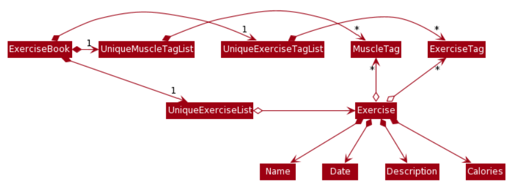
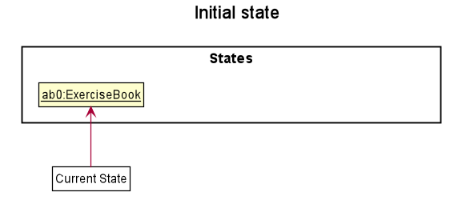
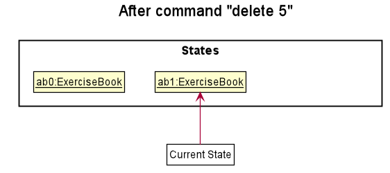
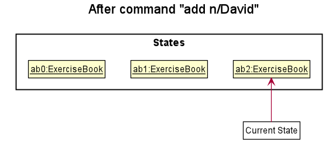
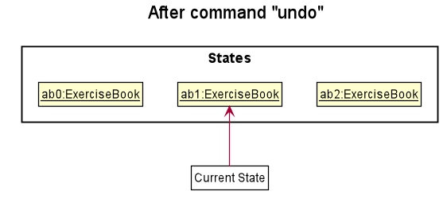
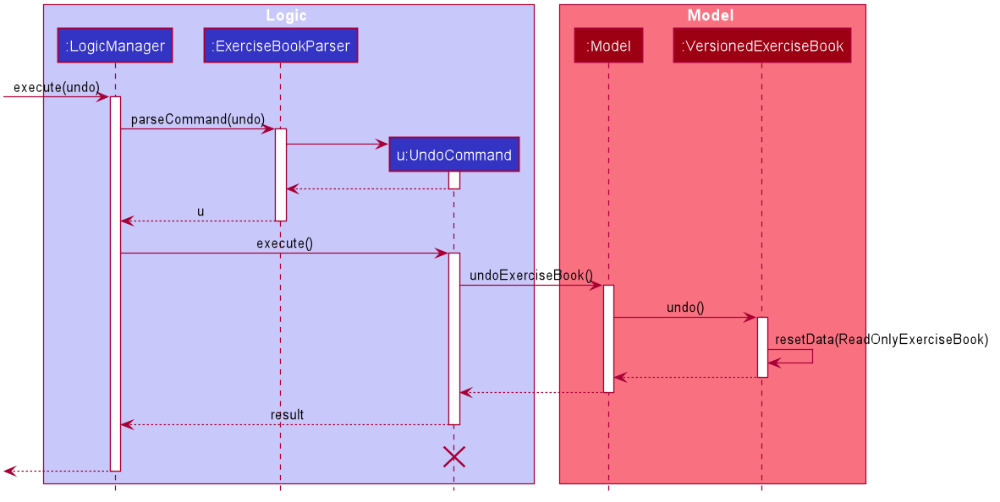
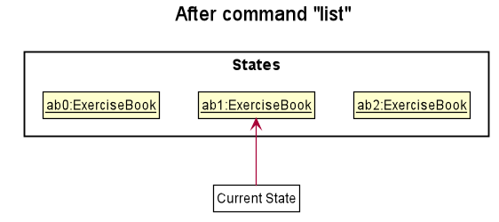
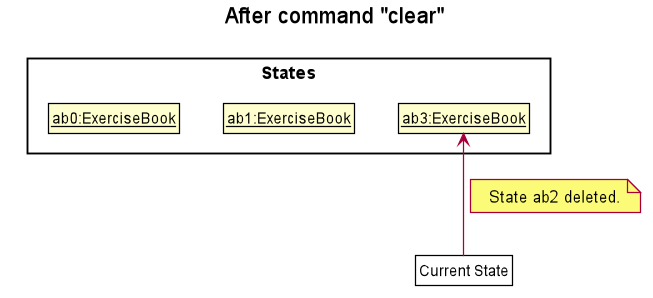

# Calo Developer Guide

## Table of Contents
1.[ About This Guide](#1-about-this-guide)  
2.[ Setting Up](#2-setting-up)  
3.[ Design](#3-design)  
* [3.1. Architecture](#31-architecture)  
* [3.2. Ui Component](#32-ui-component)
* [3.3. Logic Component](#33-logic-component)
* [3.4. Model Component](#34-model-component)
* [3.4. Storage Component](#35-storage-component)
* [3.4. Common Class](#36-common-classes)

4.[ Implementation](#4-implementation)  
5.[ Documentation, Logging and Testing](#5-documentation-logging-testing-configuration-dev-ops)  
6.[ Appendix A: Requirements](#6-appendix-a-requirements)  
7.[ Appendix B: User Stories](#7-appendix-b-user-stories)  
8.[ Appendix C: Use Cases](#8-appendix-c-use-cases)  
9.[ Appendix D: Non-Functional Requirements](#9-appendix-d-non-functional-requirements)  
10.[ Appendix E: Instructions For Manual Testing](#10-appendix-e-instructions-for-manual-testing)

--------------------------------------------------------------------------------------------------------------------

## 1. About This Guide

This document serves as a developer guide for Calo App with sufficient and comprehensive overview of the software
so that new developers, like you, will have a working knowledge of the application by the end of the guide.  

Note that this guide only provide reasonable depth. By no means this guide serves as a replacement for the actual code. 

--------------------------------------------------------------------------------------------------------------------
## 2. Setting Up

Refer to the guide [_Setting up and getting started_](SettingUp.md).

--------------------------------------------------------------------------------------------------------------------

## 3. Design

### 3.1. Architecture

The ***Architecture Diagram*** given above explains the high-level design of the App. Given below is a quick overview of each component.

:bulb: **Tip:** The `.puml` files used to create diagrams in this document can be found in the [diagrams](https://github.com/AY2021S1-CS2103T-W17-2/tp/tree/master/docs/diagrams/) folder. Refer to the [_PlantUML Tutorial_ at se-edu/guides](https://se-education.org/guides/tutorials/plantUml.html) to learn how to create and edit diagrams.

**`Main`** has two classes called [`Main`](https://github.com/AY2021S1-CS2103T-W17-2/tp/blob/master/src/main/java/seedu/address/Main.java) and [`MainApp`](https://github.com/AY2021S1-CS2103T-W17-2/tp/blob/master/src/main/java/seedu/address/ExerciseMainApp.java). It is responsible for,
* At app launch: Initializes the components in the correct sequence, and connects them up with each other.
* At shut down: Shuts down the components and invokes cleanup methods where necessary.

[**`Commons`**](#36-common-classes) represents a collection of classes used by multiple other components.

The rest of the App consists of four components.

* [**`UI`**](#32-ui-component): The UI of the App.
* [**`Logic`**](#33-logic-component): The command executor.
* [**`Model`**](#34-model-component): Holds the data of the App in memory.
* [**`Storage`**](#35-storage-component): Reads data from, and writes data to, the hard disk.

Each of the four components,

* defines its *API* in an `interface` with the same name as the Component.
* exposes its functionality using a concrete `{Component Name}Manager` class (which implements the corresponding API `interface` mentioned in the previous point.

For example, the `Logic` component (see the class diagram given below) defines its API in the `Logic.java` interface and exposes its functionality using the `LogicManager.java` class which implements the `Logic` interface.

**How the architecture components interact with each other**

The *Sequence Diagram* below shows how the components interact with each other for the scenario where the user issues the command `delete 1`.

The sections below give more details of each component.

### 3.2. UI component

**API** :
[`Ui.java`](https://github.com/AY2021S1-CS2103T-W17-2/tp/blob/master/src/main/java/seedu/address/ui/Ui.java)

The UI consists of a `MainWindow` that is made up of parts e.g.`CommandBox`, `ResultDisplay`, `ExerciseListPanel`, `StatusBarFooter` etc. All these, including the `MainWindow`, inherit from the abstract `UiPart` class.

The `UI` component uses JavaFx UI framework. The layout of these UI parts are defined in matching `.fxml` files that are in the `src/main/resources/view` folder. For example, the layout of the [`MainWindow`](https://github.com/AY2021S1-CS2103T-W17-2/tp/blob/master/src/main/java/seedu/address/ui/MainWindowForExercise.java) is specified in [`MainWindow.fxml`](https://github.com/AY2021S1-CS2103T-W17-2/tp/blob/master/src/main/resources/view/MainWindowForExercise.fxml)

The `UI` component,

* Executes user commands using the `Logic` component.
* Listens for changes to `Model` data so that the UI can be updated with the modified data.

### 3.3. Logic component

**API** :
[`Logic.java`](https://github.com/AY2021S1-CS2103T-W17-2/tp/blob/master/src/main/java/seedu/address/logic/LogicForExercise.java)

1. `Logic` uses the `ExerciseBookParser` class to parse the user command.
1. This results in a `Command` object which is executed by the `LogicManager`.
1. The command execution can affect the `Model` (e.g. adding an exercise).
1. The result of the command execution is encapsulated as a `CommandResult` object which is passed back to the `Ui`.
1. In addition, the `CommandResult` object can also instruct the `Ui` to perform certain actions, such as displaying help to the user.

Given below is the Sequence Diagram for interactions within the `Logic` component for the `execute("delete 1")` API call.

:information_source: **Note:** The lifeline for `DeleteCommandParser` should end at the destroy marker (X) but due to a limitation of PlantUML, the lifeline reaches the end of diagram.

### 3.4. Model component

**API** : [`Model.java`](https://github.com/AY2021S1-CS2103T-W17-2/tp/blob/master/src/main/java/seedu/address/model/ExerciseModel.java)

The `Model`,

* stores a `UserPref` object that represents the user’s preferences.
* stores the Exercise book data.
* exposes an unmodifiable `ObservableList<Exercise>` that can be 'observed' e.g. the UI can be bound to this list so that the UI automatically updates when the data in the list change.
* does not depend on any of the other three components.

:information_source: **Note:** An alternative (arguably, a more OOP) model is given below. It has a `Tag` list in the `ExerciseBook`, which `Exercise` references. This allows `ExerciseBook` to only require one `Tag` object per unique `Tag`, instead of each `Exercise` needing their own `Tag` object. 

### 3.5. Storage component

**API** : [`Storage.java`](https://github.com/AY2021S1-CS2103T-W17-2/tp/blob/master/src/main/java/seedu/address/storage/StorageForExercise.java)

The `Storage` component,
* can save `UserPref` objects in json format and read it back.
* can save the exercise book data in json format and read it back.

### 3.6. Common classes

Classes used by multiple components are in the `seedu.addressbook.commons` package.

--------------------------------------------------------------------------------------------------------------------

## 4. Implementation

### 4.1. Archive
(Phyo Han)  

Since Calo always stores all the exercises that the user did in the past, it is always a good idea to archive past exercises
so that the user can start afresh without the past records slowing down the performance of the application. Therefore, Calo
provides the user the `archive` function to stores these records. 

#### 4.1.1. Implementation
This section describes how the `archive` command is implemented. Unlike all the other command that only needs to interact
with `Model` component, the `archive` command needs to interact with `Storage` component which is responsible for reading
and writing `.json` file to the system, with the proper formatting for future read. 

To implement this, before executing `ArchiveCommand`, the `LogicManager` will pass `Storage` to the `ArchiveCommand`.  

A high level illustration of the executation is given in the following sequence diagram.

Step 1: Users enter the command which will consists of the keyword `archive`, the parameter `f/` followed by the file location.
This input is stored as a `String`.  
Step 2: The `String` is then passed to `ExerciseBookParser` which will cascade the `String` into meaning parts.  
Step 3: `ExerciseBookParser` create the `ArchiveCommand` and set the `Storage` component for `ArchiveCommand`.  
Step 4: `ExerciseBookParser` passes the `ArchiveCommand` back to the `LogicManager` and the `LogicManager` executes the command.
Step 5: During the executation, `ArchiveCommand` interacts with `Storage` who will write to the Local File on the user's computer.  
Step 6: If the user has no permission to write on the specific file location, an error message will appear on user screen.
Else, a success message will appear on the user Response Box.  

#### 4.1.2. Design Consideration

**Aspect**: How to decide the file path?

Alternative 1 (current choice): Have the user specify the file location and file name to store the archived file.
* Pros: Easier to implement. The user have the freedom on where to store and what to call the archived file. 
* Cons: Error prone. The user need to enter the file location  specifically whcih may be difficult for users who are used
to GUI.
* Reasons for choosing: Though this choice is more error prone, we decide that since our app is Command-Line Interface,
our users are likely accustomed to entering file location and the freedom to decide the location and name is always nice
to have. 

Alternative 2: Have a dedicated file location that the file will be stored.
* Pros: Easier for the user to archive.
* Cons: Difficult for the system to give a meaningful name to the archived file. If we were to name the file as `file_1`,
`file 2` etc, we need to check if there exists such file name first.

### 4.2. Displaying Graph of Calories Burnt
(Phyo Han)  

Since Calo aims to encourage the user to get active and track his progress, a graph of how much calories burnt for the past
few days can motivate the user to push further.

#### 4.2.1. Implementation
After each command, the UI will render itself through `MainWindow.fillInnerPart()` to update all the Ui Component. So
during this rendering process, `CaloriesGraph` takes in `HashMap` that contains the `Date` as the key and total `Calories` burn
for that day as the value. `CaloriesGraph` will then take values for the most recent 7 days (including today) and display
them on the Calories Graph.

#### 4.2.2. Design Consideration

**Aspect**: How to generate the CaloriesGraph?

Alternative 1 (current choice): Let the `LogicManager` passes a `HashMap<String,Integer>` that has `Date` as a key and
sum of `Calories` as a Integer value to `MainWindow` after each command.
Pros: Easy to implement.

Alternative 2: Convert the `HashMap<String,Integer>` that 
Pros: Follow the Design Pattern (Observer) and less stress on Call Stack (explained below)
Cons: Needs of Refactoring. Calo team has implemented the CaloriesGraph before the idea of Observer Pattern is introduced
to us. 

**Reason for Not refactoring**:   
The main reason is that it will not significant improvement in the performance of `Calo`, since the Ui needs to be re-rendered
everything after a command anyway. The only downside to current implementation is the stress put on the call stack since
in order to get the `HashMap` in `UniqueExerciseList` that contains the relevant information, it needs to be called through numerous
classes, as shown below. Current version of Calo is still 'light' enough for the system to handle the stress, but given time
`CaloriesGraph` should be refactored to fulfill the Observer Design Pattern especially when `Calo` get more complicated.

#### 4.3. Template
(Roy)  
This section describes some noteworthy details on how certain features are implemented.
I added the template class which stores information about a template. The template class has attributes name, calories,
muscleTags, and tags. The class has the get methods for the different attributes and a toString method to convert the 
template to a string in a more readable format. The class also has one parseToArgument() method which converts the 
template to the command argument. The class has one static method writeToFile which takes in template lists as parameter
and write the content of the list into the file. The class also has an equals method which takes in a template object 
and check whether the template object is equal to the template itself.
I also added a templateList class which stores the information about the template list in the app. The class has the 
following static methods:
-	getTemp: returns the template that has a specific name
-	addTemplate: add the template into the template list
-	load: load the template list from the file
-	readTask: read the template list from the file
-	checkEqual: Check whether the given template is equal to any of the template in the list
-	reset: empty the content of templatelist
The methods in the templateList classes are all static because it will be easier to just call the method in the 
templateList instead of having to create a new templateList object.
Two new parsers are also created for the command of creating a new template and the command of adding exercise from the 
template respectively. The parse method in AddExerciseFromTemplateParser parses the command of adding the exercise 
using the template and returns a new AddCommand object. The parse method in AddTemplateCommand parses the command 
of creating a new template and returns a new AddTemplateCommand object.
The template list is stored in the data file folder as a txt file.

### \[Proposed\] Undo/redo feature

#### Proposed Implementation

The proposed undo/redo mechanism is facilitated by `VersionedExerciseBook`. It extends `ExerciseBook` with an undo/redo history, stored internally as an `exerciseBookStateList` and `currentStatePointer`. Additionally, it implements the following operations:

* `VersionedExerciseBook#commit()` — Saves the current exercise book state in its history.
* `VersionedExerciseBook#undo()` — Restores the previous exercise book state from its history.
* `VersionedExerciseBook#redo()` — Restores a previously undone exercise book state from its history.

These operations are exposed in the `Model` interface as `Model#commitExerciseBook()`, `Model#undoExerciseBook()` and `Model#redoExerciseBook()` respectively.

Given below is an example usage scenario and how the undo/redo mechanism behaves at each step.

Step 1. The user launches the application for the first time. The `VersionedExerciseBook` will be initialized with the initial exercise book state, and the `currentStatePointer` pointing to that single exercise book state.

Step 2. The user executes `delete 5` command to delete the 5th person in the exercise book. The `delete` command calls `Model#commitExerciseBook()`, causing the modified state of the exercise book after the `delete 5` command executes to be saved in the `exerciseBookStateList`, and the `currentStatePointer` is shifted to the newly inserted exercise book state.

Step 3. The user executes `add n/David …​` to add a new person. The `add` command also calls `Model#commitExerciseBook()`, causing another modified exercise book state to be saved into the `exerciseBookStateList`.

:information_source: **Note:** If a command fails its execution, it will not call `Model#commitExerciseBook()`, so the exercise book state will not be saved into the `exerciseBookStateList`.

Step 4. The user now decides that adding the person was a mistake, and decides to undo that action by executing the `undo` command. The `undo` command will call `Model#undoExerciseBook()`, which will shift the `currentStatePointer` once to the left, pointing it to the previous exercise book state, and restores the exercise book to that state.

:information_source: **Note:** If the `currentStatePointer` is at index 0, pointing to the initial ExerciseBook state, then there are no previous ExerciseBook states to restore. The `undo` command uses `Model#canUndoExerciseBook()` to check if this is the case. If so, it will return an error to the user rather
than attempting to perform the undo.

The following sequence diagram shows how the undo operation works:

:information_source: **Note:** The lifeline for `UndoCommand` should end at the destroy marker (X) but due to a limitation of PlantUML, the lifeline reaches the end of diagram.

The `redo` command does the opposite — it calls `Model#redoExerciseBook()`, which shifts the `currentStatePointer` once to the right, pointing to the previously undone state, and restores the exercise book to that state.

:information_source: **Note:** If the `currentStatePointer` is at index `exerciseBookStateList.size() - 1`, pointing to the latest exercise book state, then there are no undone ExerciseBook states to restore. The `redo` command uses `Model#canRedoExerciseBook()` to check if this is the case. If so, it will return an error to the user rather than attempting to perform the redo.

Step 5. The user then decides to execute the command `list`. Commands that do not modify the exercise book, such as `list`, will usually not call `Model#commitExerciseBook()`, `Model#undoExerciseBook()` or `Model#redoExerciseBook()`. Thus, the `exerciseBookStateList` remains unchanged.

Step 6. The user executes `clear`, which calls `Model#commitExerciseBook()`. Since the `currentStatePointer` is not pointing at the end of the `exerciseBookStateList`, all exercise book states after the `currentStatePointer` will be purged. Reason: It no longer makes sense to redo the `add n/David …​` command. This is the behavior that most modern desktop applications follow.

The following activity diagram summarizes what happens when a user executes a new command:

#### Design consideration:

##### Aspect: How undo & redo executes

* **Alternative 1 (current choice):** Saves the entire exercise book.
  * Pros: Easy to implement.
  * Cons: May have performance issues in terms of memory usage.

* **Alternative 2:** Individual command knows how to undo/redo by
  itself.
  * Pros: Will use less memory (e.g. for `delete`, just save the person being deleted).
  * Cons: We must ensure that the implementation of each individual command are correct.

_{more aspects and alternatives to be added}_

### Aspect: How to archive Data

* **Current Choice:** Using Archive Command.
  * Implementation: Have a separate Archive Command to let the User specify the file location.
  * Pros: The user can specify the location where users want to save the data.
  * Cons: Error prone. The user need to enter the file location specification which may be difficult for users who are not used to command prompt.

--------------------------------------------------------------------------------------------------------------------

## 5. Documentation, logging, testing, configuration, dev-ops

* [Documentation guide](Documentation.md)
* [Testing guide](Testing.md)
* [Logging guide](Logging.md)
* [Configuration guide](Configuration.md)
* [DevOps guide](DevOps.md)

--------------------------------------------------------------------------------------------------------------------

## 6. Appendix A: Requirements

### Product scope

**Target user profile**:

* has a need to manage their workouts
* prefer desktop apps over other types
* can type fast
* prefers typing to mouse interactions
* is reasonably comfortable using CLI apps

**Value proposition**: manage workouts faster than a typical mouse/GUI driven desktop/mobile app

--------------------------------------------------------------------------------------------------------------------

### 7. Appendix B: User stories

Priorities: High (must have) - `* * *`, Medium (nice to have) - `* *`, Low (unlikely to have) - `*`

| Priority | As a …​                                    | I want to …​                     | So that I can…​                                                        |
| -------- | ------------------------------------------ | ------------------------------ | ---------------------------------------------------------------------- |
| `* * *`  | user                                       | add an exercise                | keep track of calories burnt through the day                           |
| `* * *`  | user                                       | create a template | store exercises that I do frequently for future reference. |
| `* * *`  | user                                       | create an exercise based on template | record exercises that I do frequently faster. |
| `* * *`  | user                                       | delete an exercise in case I key in wrongly |  |
| `* * *`  | user                                       | have a system that tolerate invalid/incomplete command |           |
| `* * *`  | data conscious user                        | list down all the exercises for the day | monitor the calories burned accurately |
| `* * *`  | user                                       | see all the templates I have created | |
| `* * *`  | user                                       | see my progress for the past week | know the progress that I have been making so far |
| `* *`    | user                                       | add tags to an Exercise | |
| `* *`    | user                                       | create an exercise from template with different details such as calories | account for the same exercises that I did with different intensity  |
| `* *`    | user                                       | clear all information stored in the application | |
| `* *`    | user                                       | find the most recent information of a particular exercise | |
| `* *`    | user                                       | indicate which are the muscle group that an exercise work on | better track which muscles that I have worked on |
| `* *`    | user                                       | know how much more calories I need to burn to reach the goal | |
| `* *`    | user                                       | set a goal for a day | |
| `* *`    | user                                       | update an exercise             |  |
| `*`    | user                                       | save my data in a file         | import the saved data into the new computer |

### 8. Appendix C: Use cases

(For all use cases below, the **System** is the `Calo` and the **Actor** is the `user`, unless specified otherwise)

  #### **Use case: add an exercise**

  *MSS*

1.  User requests to add an exercise

2.  Calo adds the exercise and displays on the Graph.
  Use case ends.

#### **Use case: Find exercises with a keyword**

*MSS*

1.  User requests to find exercises with a keyword
2.  Calo shows a list of exercises which contain the keyword
    Use case ends.

*Extensions*

    The list is empty  
      1a1. Calo shows a message indicating that no such exercise exists. 
    Use case ends.

#### **Use case: Update an exercise**

*MSS*

1.  User requests to update a specific exercise in the list
2.  Calo updates the exercise
    Use case ends. 
*Extensions*

    1a. The index is invalid 
      1a1. Calo shows a message indicating that no such exercise exists. 
    Use case ends.

#### **Use case: Delete an exercise**

*MSS*

1.  User requests to delete a specific exercise in the list.
2.  Calo deletes the exercise

    Use case ends.

*Extensions*

    1a. The index is invalid 
      1a1. Calo shows a message indicating that no such exercise exists. 
    Use case ends.

  #### **Use case: Archive data**
  *MSS*
  1.  User requests to archive data to a different file location
  2.  Calo archives data to the specified location
    Use case ends.

*Extensions*

    1a. User does not have permission to create file at specified location  
      1a1. Calo shows a message indicating that file cannot be created at specified file. 
    Use case ends.

  #### **Use case: List exercises**

  *MSS* 
  1.  User requests to list exercises
  2.  Calo shows a list of exercises
      Use case ends.

### 9. Appendix D: Non-Functional Requirements
1.  Should work on any _mainstream OS_ as long as it has Java `11` or above installed.
2.  Should be able to hold up to 1000 exercise items without a noticeable sluggishness in performance for typical usage.
3.  A user with above average typing speed for regular English text (i.e. not code, not system admin commands) should be able to accomplish most of the tasks faster using commands than using the mouse.

### Glossary

* **Calories Graph**: the graph that displays the trends of the user's calories burnt in the past 6 days (including today)
* **Exercise**: an exercise record entered by the user, consisting of exercise name, description, and date (optionally calories)
* **Exercise Tag**: Additional Tag that you want to assign to the Exercise you just did.
* **Mainstream OS**: Windows, Linux, Unix, OS-X
* **Muscle Tag**: the muscles that the exercise works out.
* **Template**: a skeleton of the template without date, muscleTag and exerciseTag. It exists to ensure that the user key in exercises, that he does frequently, more quickly.
--------------------------------------------------------------------------------------------------------------------

## 10. Appendix E: Instructions for manual testing

Given below are instructions to test the app manually.

:information_source: **Note:** These instructions only provide a starting point for testers to work on;
testers are expected to do more *exploratory* testing.

### Launch and shutdown
1. Initial launch
   1. Download the jar file and copy into an empty folder
   1. Double-click the jar file Expected: Shows the GUI with a set of sample contacts. The window size may not be optimum.
1. Saving window preferences
   1. Resize the window to an optimum size. Move the window to a different location. Close the window.
   1. Re-launch the app by double-clicking the jar file. 
       Expected: The most recent window size and location is retained.
1. _{ more test cases …​ }_

### Deleting an exercise
1. Deleting an exercise while all exercises are being shown
   1. Prerequisites: List all exercises using the `list` command. Multiple exercises in the list.
   1. Test case: `delete 1` 
      Expected: First contact is deleted from the list. Details of the deleted contact shown in the status message. Timestamp in the status bar is updated.
   1. Test case: `delete 0` 
      Expected: No exercise is deleted. Error details shown in the status message. Status bar remains the same.
   1. Other incorrect delete commands to try: `delete`, `delete x`, `...` (where x is larger than the list size) 
      Expected: Similar to previous.
1. _{ more test cases …​ }_

### Saving data

1. Dealing with missing/corrupted data files
   1. _{explain how to simulate a missing/corrupted file, and the expected behavior}_
1. _{ more test cases …​ }_
